# Redrx 🚀

Redrx is a high-performance, feature-rich URL shortener migrated from Python to **Go**. It features a sleek dark UI, asynchronous analytics, local GeoIP resolution, and robust security.

---

## 🏗 Architecture Overview

```mermaid
graph TD
    Client["🌐 Client (Browser/API)"]
    Gin["🚀 Gin Gonic Web Server"]
    Psql[("🐘 PostgreSQL 17 (Primary Store)")]
    Redis[("⚡ Redis 7.4 (Cache/Rate Limit)")]
    GeoIP["📍 MaxMind GeoIP2 (Local DB)"]
    Workers["👷 Background Workers"]

    Client -->|HTTP Requests| Gin
    Gin -->|Auth/Cache| Redis
    Gin -->|Persistence| Psql
    Gin -->|Analytics| Workers
    Workers -->|IP Lookup| GeoIP
    Workers -->|Write Stats| Psql
```



## 🔄 Core Flows

### 1. URL Shortening Flow


### 2. Redirect & Analytics Flow


---

## ✨ Features

- **Custom Short Codes:** Create memorable links.
- **Async Analytics:** High-performance click tracking using buffered channels and workers.
- **Local GeoIP Resolution:** Privacy-focused geolocation using MaxMind DBs (no external API calls for lookups).
- **Customizable QR Codes:** Generate QR codes with custom colors and embedded logos.
- **Security First:** 
  - Rate limiting (Redis-backed).
  - Phishing protection.
  - IP Masking (GDPR compliant).
  - Audit logging for all administrative actions.
- **Access Control:** Configurable login requirements and public registration toggles.
- **Docker Ready:** Optimized multi-stage builds with automatic MaxMind updates.

## 🛠 Tech Stack

- **Backend:** Go 1.24 (Gin Gonic)
- **Database:** PostgreSQL 17
- **Cache/Queue:** Redis 7.4
- **Geo-Location:** Local MaxMind GeoIP2 (via `geoipupdate`)
- **Frontend:** HTML5, Vanilla CSS3, JavaScript (Chart.js for analytics)
- **CI/CD:** GitHub Actions (Golangci-lint, Govulncheck, Docker Push to GHCR)

## 🚀 Quick Start (Docker)

1. **Clone the repository**
2. **Setup MaxMind (Optional but Recommended)**:
   Add your credentials to `.env`:
   ```env
   MAXMIND_ACCOUNT_ID=your_id
   MAXMIND_LICENSE_KEY=your_key
   ```
3. **Run with Docker Compose**:
   ```bash
   docker-compose up -d --build
   ```
4. **Access the App**: `http://localhost:8080`

## 🔧 Configuration

| Variable | Default | Description |
|----------|---------|-------------|
| `PORT` | `8080` | Application port. |
| `DATABASE_URL` | - | PostgreSQL connection string. |
| `REDIS_URL` | - | Redis connection string. |
| `MAXMIND_LICENSE_KEY` | - | Required for automated GeoIP database updates. |
| `APP_ENV` | `production` | Set to `development` for verbose logging. |

## 🛠 Local Development

### Prerequisites
- Go 1.24+
- PostgreSQL 17
- Redis 7.4

### Commands
```bash
# Install dependencies
go mod download

# Run tests
go test ./...

# Build
go build -o server ./cmd/server

# Run
./server
```

## 🔌 API Quick Reference

### Authentication
Include your API key in the header:
`X-API-KEY: your_api_key`

### Shorten URL
`POST /api/v1/shorten`
```json
{
  "long_url": "https://example.com",
  "custom_code": "my-link",
  "password": "optional-secret"
}
```

## 🛡 Security

Redrx uses automated security scanning:
- **Linting**: `golangci-lint` for code quality.
- **Vulnerability Scan**: `govulncheck` for dependency security.
- **Audit Logs**: Tracks all user logins, registrations, and API key changes.